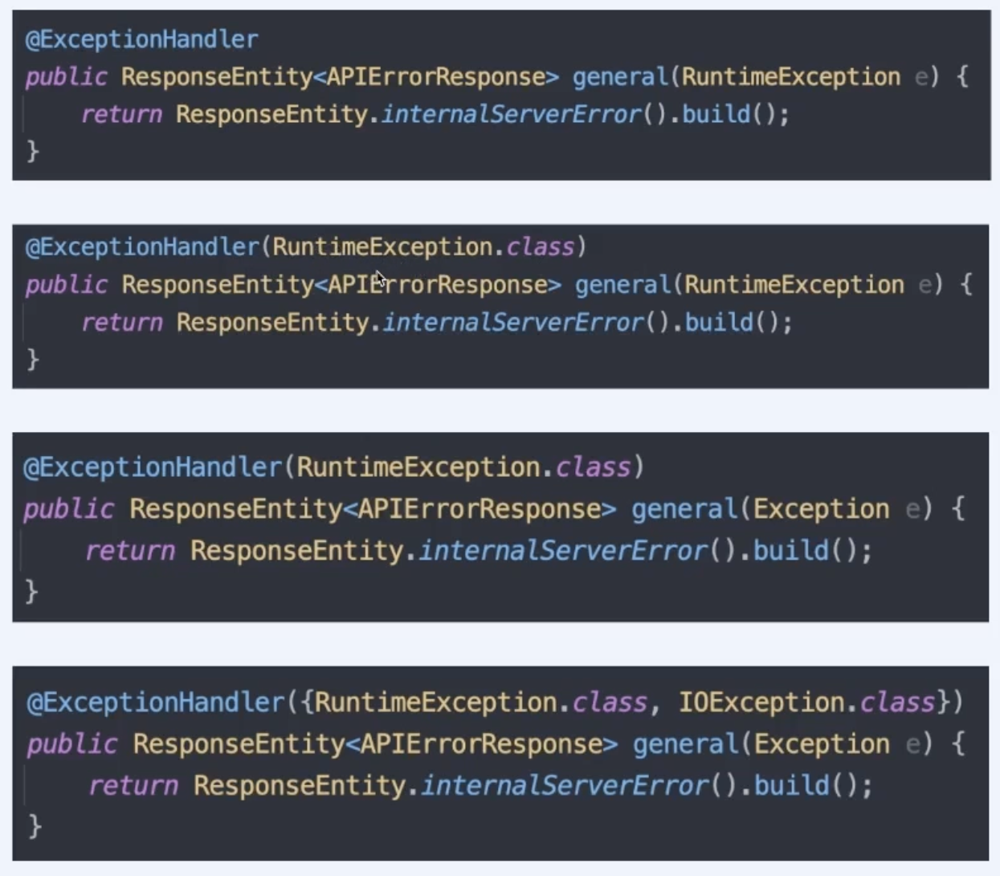

## At properties

```s
// 기본 화이트라벨 에러 페이지 비활성화 
server.error.whitelabel.enabled=false
``` 

- ### 아래는 시스템 정보 유출로 프로덕션 레벨로 올라가면 비활성화 해줘야 한다.

```s
// 스택트랩 에러페이지에 포함 활성화 
server.error.include-stacktrace=always

// 메세지 에러페이지에 포함 활성화 
server.error.include-message=always
    
// 예외 에러페이지에 포함 활성화 
server.error.include-exception=true
```

## At view

단순히 static html이나 template 파일을 추가해서 커스텀 페이지를 등록하는 방법.

- ### 단일 기본 페이지
    * /resources/static/error.html
    * /resources/public/error.html
    * /resoutces/template/error.[템플릿 확장자]

- ### http status 별 기본 페이지
    * /resources/[static|public|template]/error/{http status 번호}.{html | 템플릿 확장자}
    * /resources/[static|public|template]/error/4xx.[html | 템플릿 확장자]
    * /resources/[static|public|template]/error/5xx.[html | 템플릿 확장자]

## At controller

```java
@RequestMapping("/error") 
public String error() {
    return "error";
}
```
- errorController method를 구현한다.
- @RequestMapping을 사용한 이유는 GET, POST 모든 요청을 받기 위해서이다. 
- 그냥 만들기만 하면 기본적으로 동작하는 errorController와 스팩이 같기 때문에 충돌하여 에러가 발생한다.  
우리가 완전히 errorController에 대한 제어권을 가져오기 위해서는 marker interface인   
ErrorController라는 클레스를 implements해야한다. 

    - **marker inferface란?**
    
        ```
        기본적인 인터페이스와 동일하지만 아무런 메소드가 없다.
        때문에 단지 타입을 체크하는 용도로 사용된다.
        ```

### @ExceptinoHandler

- 비즈니스 로직이 던진 예외에 반응하는 핸들러 메소드
- 위치 : 특정 controller 클레스 내부 OR @ControllerAdvice 컨포넌트 내부
- 특정 예외에 반응
- 예외 처리 범위
    - controller 내부에 작성했을 경우 : 해당 controller만
    - @ControllerAdvice 내부 : 프로젝츠 전체
- 핸들러 메소드에 포함되기 때문에 입출력 자료형도 핸들러 메소드와 유사하지만,   
예외를 입력 인자로 받을 수 있다는 점에서 차이가 있다.


